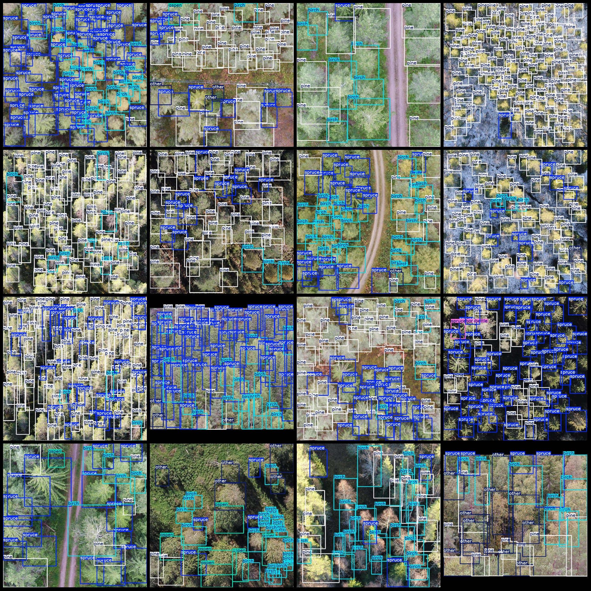
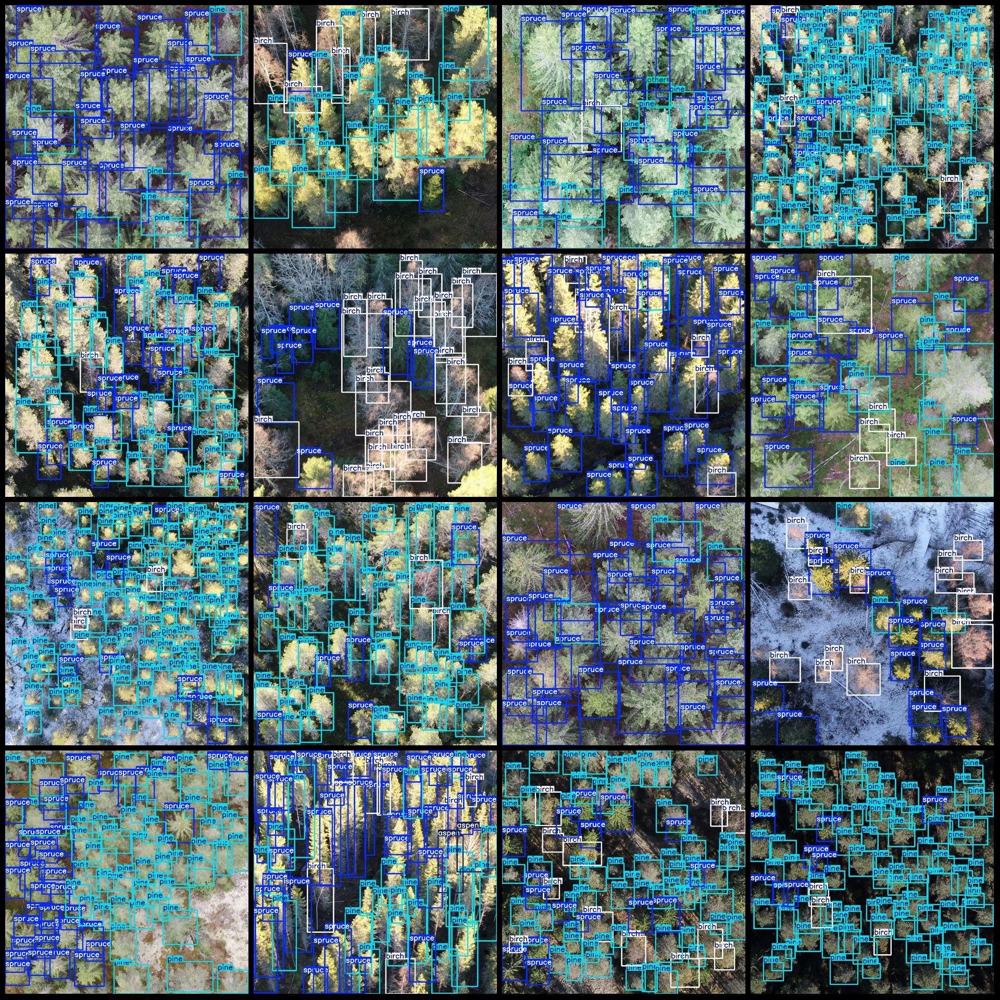

# Drone Perspective Five Types of Trees Detection Data Set (VOC+YOLO Format) with 3071 Images, 6 Categories

Dataset Format: Pascal VOC format + YOLO format (txt file without split path, only containing JPG images and corresponding VOC format xml files and YOLO format txt files)
Number of Images (JPG File Count): 3071
Number of Annotations (Xml File Count): 3071
Number of Annotations (Txt File Count): 3071
Number of Annotation Categories: 6
Annotation Category Names (Note that the order of categories in the YOLO format does not correspond to this list, but is based on the labels folder's classes.txt): ["aspen", "birch", "other", "pine", "spruce", "sprucebarkbettle"]
Number of Boxes per Category:
- aspen (Ash tree) boxes = 796
- birch (Birch tree) boxes = 28178
- other (Other) boxes = 2971
- pine (Pine tree) boxes = 79845
- spruce (Spruce tree) boxes = 78743
- sprucebarkbettle (Sprucebark beetle) boxes = 147
Total box count: 190680
Image Resolution: 1024x1024
Annotation Tool: labelImg
Annotation Rules: Draw a rectangle around the category
Important Notice: No special statements are made at this time
Special Statement: This dataset does not guarantee any accuracy of trained models or weights files
Drone: DJI MAVIC 2
Collecting Height: 20~60m
Collecting Angle: 70-90°
Image Preview:
Annotation Example:

## Picture

Here is a pay link on Stripe ( https://buy.stripe.com/3cs8yP7sY87d0vu9AB ). Please contact me lonlonago@foxmail.com after funding $89, and I will send you a complete data files , thank you!

